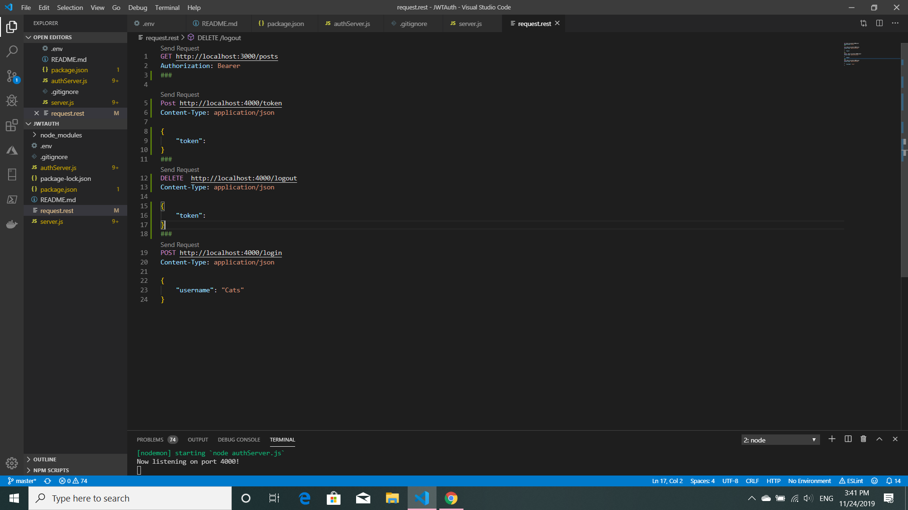
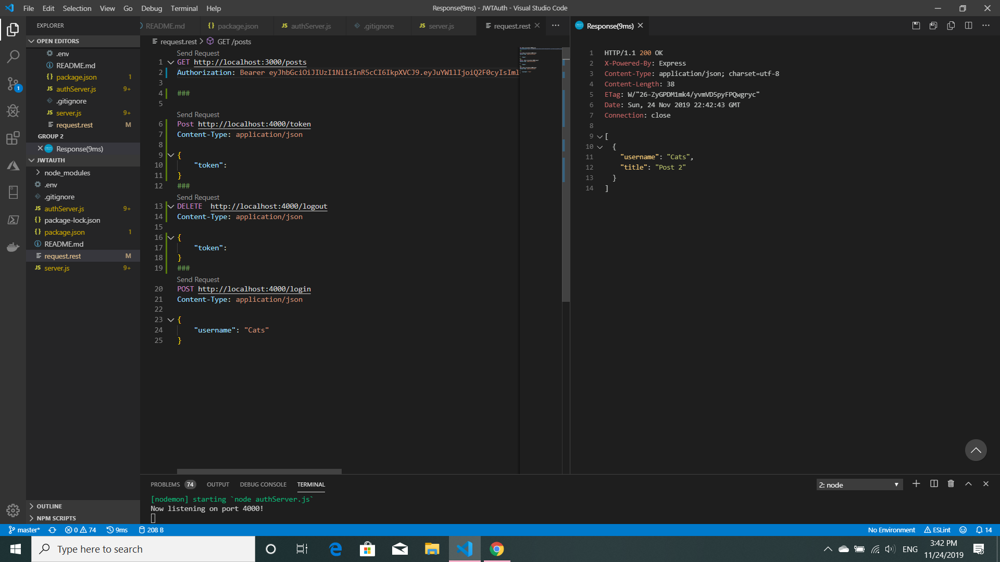
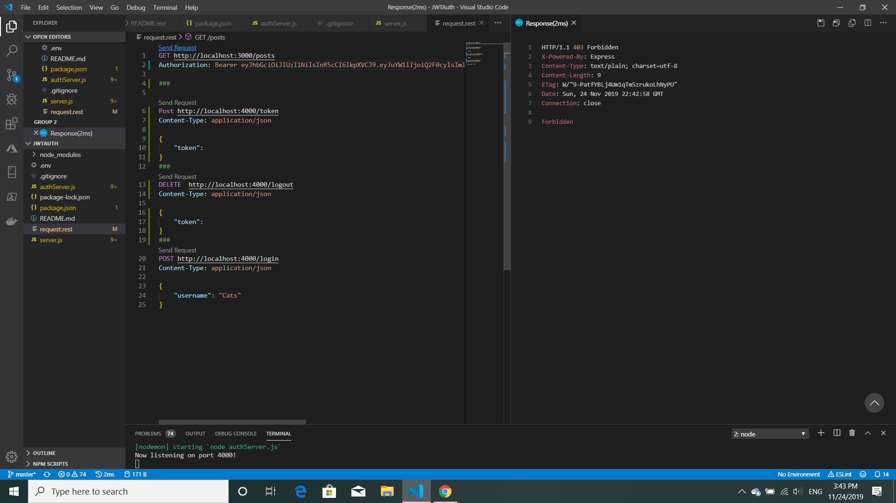
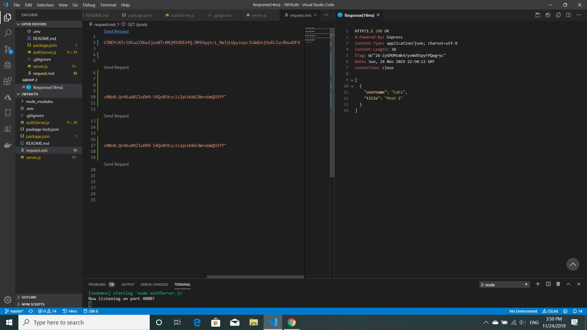
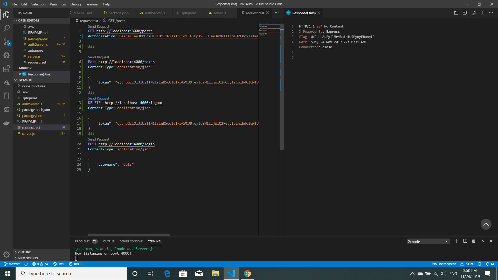
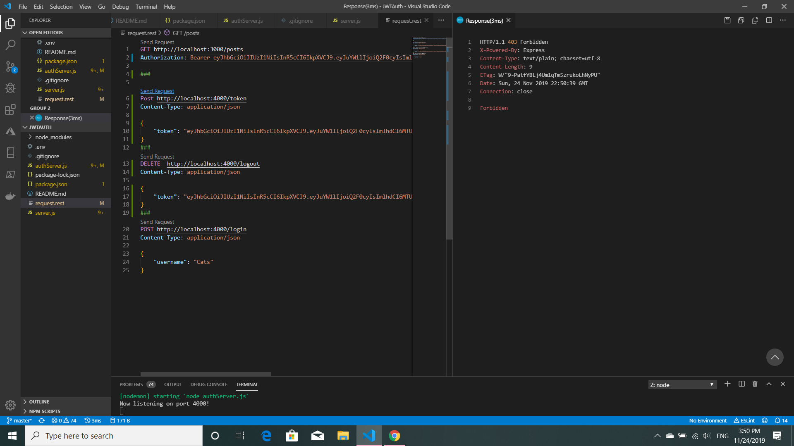

## JWT AUTH

JWT AUTH (Json Webtoken Authentication) is a small learning program from [Web Dev Simplified](https://www.youtube.com/channel/UCFbNIlppjAuEX4znoulh0Cw).
It shows how to make a JSON web token and uses two servers, one for login and another for authentication. The program uses Express, jsonwebtoken and an extention to Visual Studio Code called REST Client that works like postman within VSC.

This screenshot is before any requests are made:

In this screenshot an access token has been made and used to authenticate the user 'Cats':

After 20 seconds the access token has expired and 'Cats' is no longer authenticated:

A refresh token is generated, which will keep making access tokens for as long as the user is logged in:

In order to keep the user information secure, the refresh token must be deleted when the user logs out. In this screenshot the delete request has been made and the token deleted:

After logging out the user no longer has access to the site, it is now *forbidden*:

This little program was a great way to learn about making JWT tokens. Thanks Web Dev Simplified!